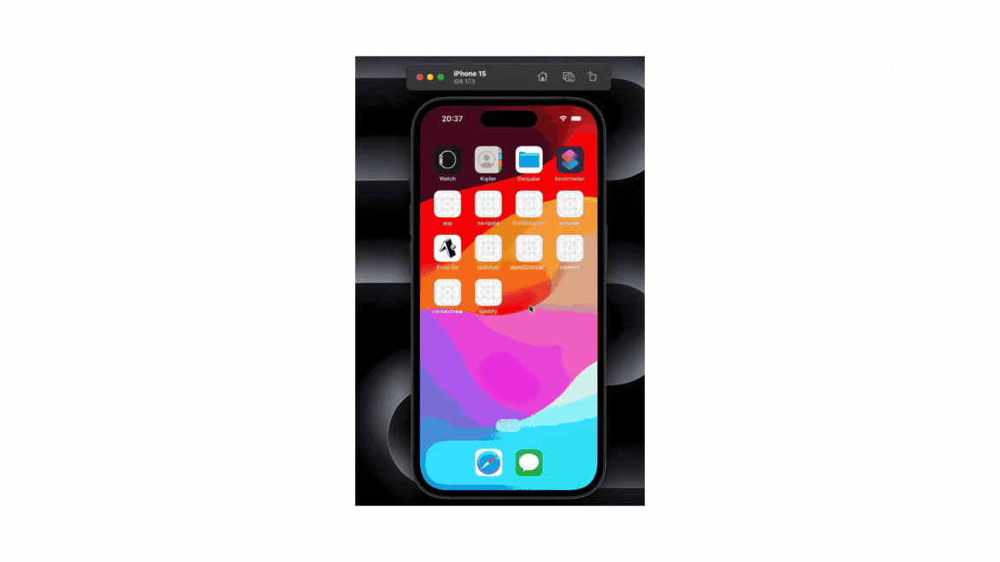

# Spotify App Clone

- Bu projede, React Native ve çeşitli kütüphaneleri kullanarak, Spotify uygulamasının temel özelliklerini taklit eden bir mobil uygulama geliştirdim. Bu süreçte öğrendiğim ve kullandığım bazı teknolojiler şunlar:
* React Native: Kullanıcı arayüzünü oluşturmak ve platformlar arası uyumluluk sağlamak için.
* @react-navigation/bottom-tabs ve @react-navigation/native-stack: Uygulama içinde gezinme ve ekran geçişleri için.
* Axios: API çağrıları ve veri çekme işlemleri için.
* Lodash: Veri işleme ve manipülasyonları için.
* React Native Vector Icons: Uygulama içinde ikon kullanımı için.
* React Native Track Player: Müzik çalma fonksiyonelliği için.
Projede kullanılan diğer kütüphaneler:
* @react-native-async-storage/async-storage
* @react-navigation/native
* react-native-app-auth
* react-native-gesture-handler
* react-native-linear-gradient
* react-native-modal
* react-native-safe-area-context
* react-native-screens
* react-native-sound

- Ekran Görünümü

# Spotify-APP-Clone
